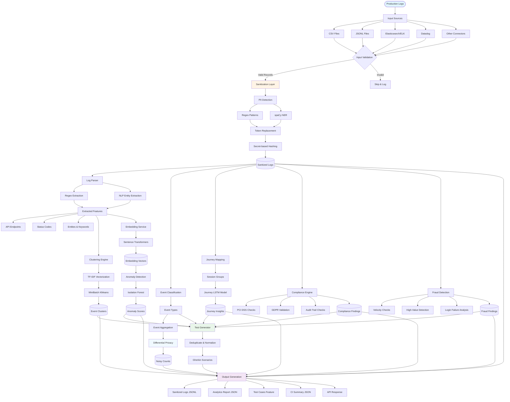

# LogMiner-QA Workflow Diagram

## System Architecture Flow



## Detailed Component Workflow

### Phase 1: Input & Validation
```
┌─────────────────────────────────────────────────────────────┐
│                    INPUT SOURCES                             │
├─────────────────────────────────────────────────────────────┤
│  • CSV Files          → DictReader → Iterable[Dict]         │
│  • JSONL Files        → Line-by-line → Iterable[Dict]       │
│  • JSON Files         → Full load → List[Dict]              │
│  • Elasticsearch      → Query → Iterable[Dict]              │
│  • Datadog            → API → Iterable[Dict]                │
└─────────────────────────────────────────────────────────────┘
                          │
                          ▼
┌─────────────────────────────────────────────────────────────┐
│                  INPUT VALIDATION                            │
├─────────────────────────────────────────────────────────────┤
│  ✓ Size checks (max 1MB per record)                         │
│  ✓ Nesting depth (max 20 levels)                            │
│  ✓ Field count (max 10,000 keys)                            │
│  ✓ Type validation (dict/str/list)                          │
│  → Invalid records logged & skipped                          │
└─────────────────────────────────────────────────────────────┘
```

### Phase 2: Sanitization (Security Layer)
```
┌─────────────────────────────────────────────────────────────┐
│                SANITIZATION PIPELINE                         │
├─────────────────────────────────────────────────────────────┤
│                                                              │
│  Step 1: PII Detection                                       │
│  ├─ Regex Patterns (emails, accounts, IBANs, phones)       │
│  └─ spaCy NER (names, organizations, locations)             │
│                                                              │
│  Step 2: Token Replacement                                   │
│  ├─ Original: "user@example.com"                            │
│  ├─ Token Store Lookup/Create                               │
│  └─ Replaced: "[TOKEN_D6C6034EE2DCCA632E5C1B22]"            │
│                                                              │
│  Step 3: Secret-based Hashing                                │
│  ├─ Uses: LOGMINER_HASH_SECRET env var                      │
│  ├─ Algorithm: SHA-256 (configurable)                       │
│  └─ Output: Deterministic hash for referential integrity    │
│                                                              │
│  Step 4: Batch Persistence                                   │
│  └─ Token store writes every 100 new tokens (optimized)     │
│                                                              │
└─────────────────────────────────────────────────────────────┘
```

### Phase 3: Analysis Pipeline
```
┌─────────────────────────────────────────────────────────────┐
│              PARALLEL ANALYSIS STREAMS                       │
├─────────────────────────────────────────────────────────────┤
│                                                              │
│  Stream A: Log Parsing                                       │
│  ├─ Extract: API endpoints, status codes, amounts           │
│  ├─ NLP: Entities, keywords, lemmatization                  │
│  └─ Output: ParsedRecord with structured metadata           │
│                                                              │
│  Stream B: Event Classification                              │
│  ├─ Use: event field, transaction_type, message content     │
│  ├─ Categories: session_start, teller_login, deposit, etc.  │
│  └─ Output: Event labels per record                         │
│                                                              │
│  Stream C: Journey Mapping                                   │
│  ├─ Extract: session_id, journey_id, hashed_fields          │
│  ├─ Group: Events by journey identifier                     │
│  └─ Output: Journey map (journey_id → [events])             │
│                                                              │
└─────────────────────────────────────────────────────────────┘
```

### Phase 4: Machine Learning Processing
```
┌─────────────────────────────────────────────────────────────┐
│                  ML/AI COMPONENTS                            │
├─────────────────────────────────────────────────────────────┤
│                                                              │
│  1. Clustering (MiniBatch KMeans)                            │
│     Input: Sanitized log messages                            │
│     Process: TF-IDF vectorization → KMeans clustering       │
│     Output: Cluster labels + top terms per cluster          │
│                                                              │
│  2. Embeddings (Sentence Transformers)                       │
│     Input: Log messages (batched, 32 per batch)             │
│     Model: all-MiniLM-L6-v2                                  │
│     Output: 384-dim embedding vectors                        │
│                                                              │
│  3. Anomaly Detection (Isolation Forest)                     │
│     Input: Embedding vectors                                 │
│     Process: Fit Isolation Forest → Score anomalies          │
│     Output: Anomaly scores + threshold                       │
│                                                              │
│  4. Journey Modeling (LSTM)                                  │
│     Input: Journey event sequences                           │
│     Process: Sequence encoding → LSTM training → Predictions │
│     Output: Anomalous journeys + next-event probabilities    │
│                                                              │
└─────────────────────────────────────────────────────────────┘
```

### Phase 5: Compliance & Fraud Intelligence
```
┌─────────────────────────────────────────────────────────────┐
│           COMPLIANCE & FRAUD ENGINES                         │
├─────────────────────────────────────────────────────────────┤
│                                                              │
│  Compliance Engine:                                          │
│  ├─ PCI DSS: Card data masking validation                   │
│  ├─ GDPR: Data access request logging                       │
│  ├─ Audit Trail: Transaction completeness checks            │
│  └─ Output: ComplianceFinding objects + test scenarios      │
│                                                              │
│  Fraud Detection Engine:                                     │
│  ├─ Velocity: Transactions per account/time window          │
│  ├─ High-Value: Large transaction amounts                   │
│  ├─ Login Failures: Repeated failed authentication          │
│  └─ Output: FraudFinding objects + test scenarios           │
│                                                              │
└─────────────────────────────────────────────────────────────┘
```

### Phase 6: Differential Privacy & Aggregation
```
┌─────────────────────────────────────────────────────────────┐
│         PRIVACY-PRESERVING AGGREGATION                       │
├─────────────────────────────────────────────────────────────┤
│                                                              │
│  Input: Raw event counts (e.g., {"error_event": 150})       │
│                                                              │
│  Process:                                                    │
│  ├─ Epsilon: 1.0 (privacy budget, configurable)             │
│  ├─ Sensitivity: 1.0 (difference one record can make)       │
│  ├─ Scale: sensitivity / epsilon                            │
│  └─ Laplace Noise: Sample from Laplace(0, scale)            │
│                                                              │
│  Output: Noisy counts (e.g., {"error_event": 148 ± 3})      │
│                                                              │
│  Guarantee: ε-differential privacy                           │
│                                                              │
└─────────────────────────────────────────────────────────────┘
```

### Phase 7: Test Generation & Deduplication
```
┌─────────────────────────────────────────────────────────────┐
│              TEST GENERATION PIPELINE                        │
├─────────────────────────────────────────────────────────────┤
│                                                              │
│  Step 1: Collect Test Sources                                │
│  ├─ Journey patterns (from journey_map)                     │
│  ├─ Compliance findings                                      │
│  └─ Fraud findings                                           │
│                                                              │
│  Step 2: Deduplicate                                         │
│  ├─ Remove consecutive duplicate events                     │
│  ├─ Normalize journey signatures                            │
│  └─ Track seen patterns (set-based)                         │
│                                                              │
│  Step 3: Render Gherkin                                      │
│  ├─ Feature: Journey {journey_id}                           │
│  ├─ Scenario: Validate journey {journey_id}                 │
│  ├─ Given: sanitized transaction journey                    │
│  ├─ When: system observes {event} (for each event)          │
│  └─ Then: compliance checks pass                            │
│                                                              │
│  Step 4: Output                                              │
│  └─ Write to .feature file or API response                  │
│                                                              │
└─────────────────────────────────────────────────────────────┘
```

### Phase 8: Output Generation
```
┌─────────────────────────────────────────────────────────────┐
│                    OUTPUT ARTIFACTS                          │
├─────────────────────────────────────────────────────────────┤
│                                                              │
│  1. sanitized_logs.jsonl                                     │
│     └─ One JSON object per line (PII-free, analysis data)   │
│                                                              │
│  2. full_report.json                                         │
│     ├─ frequency_report (DP-noised counts)                  │
│     ├─ cluster_summary (clusters + top terms)               │
│     ├─ anomaly_summary (scores + top indices)               │
│     ├─ journey_insights (anomalous journeys + predictions)  │
│     ├─ compliance_findings (PCI/GDPR/audit issues)          │
│     └─ fraud_findings (velocity/high-value/failures)        │
│                                                              │
│  3. generated_tests.feature                                  │
│     └─ Gherkin scenarios (deduplicated, unique patterns)    │
│                                                              │
│  4. ci_summary.json                                          │
│     ├─ total_records                                         │
│     ├─ high_severity_findings                                │
│     ├─ anomalies_detected                                    │
│     └─ top_clusters                                          │
│                                                              │
└─────────────────────────────────────────────────────────────┘
```

## Data Flow Summary

```
Raw Logs
   │
   ├─► [Validation] ──┐
   │                  │
   ▼                  ▼
[Sanitization] ──► [Parsing] ──► [Classification]
   │                  │              │
   │                  ├─► [Clustering] ──┐
   │                  │                  │
   │                  ├─► [Embeddings] ──► [Anomaly Detection] ──┐
   │                  │                                            │
   │                  └─► [Journey Mapping] ──► [LSTM Model] ────┤
   │                                                               │
   ├─► [Compliance Engine] ───────────────────────────────────────┤
   │                                                               │
   ├─► [Fraud Detection] ─────────────────────────────────────────┤
   │                                                               │
   └─► [Event Aggregation] ──► [Differential Privacy] ────────────┤
                                                                   │
                                                                   ▼
                                                    [Test Generation & Deduplication]
                                                                   │
                                                                   ▼
                                                    [Output Files & Reports]
```

## Performance Optimizations

- **Streaming Processing**: Records processed in 1,000-record chunks
- **Batch Token Persistence**: Writes every 100 new tokens (not per-record)
- **Embedding Batching**: 32 texts per batch with progress tracking
- **Memory Management**: Only necessary data kept in memory
- **Progress Logging**: Updates every 5,000 records for large datasets

## Security Checkpoints

1. ✅ Input validation prevents DoS attacks
2. ✅ PII detection and tokenization
3. ✅ Secret-based hashing (LOGMINER_HASH_SECRET required)
4. ✅ Differential privacy on aggregates
5. ✅ On-premise deployment (no external calls)
6. ✅ Token store encryption (via filesystem/volume encryption)

